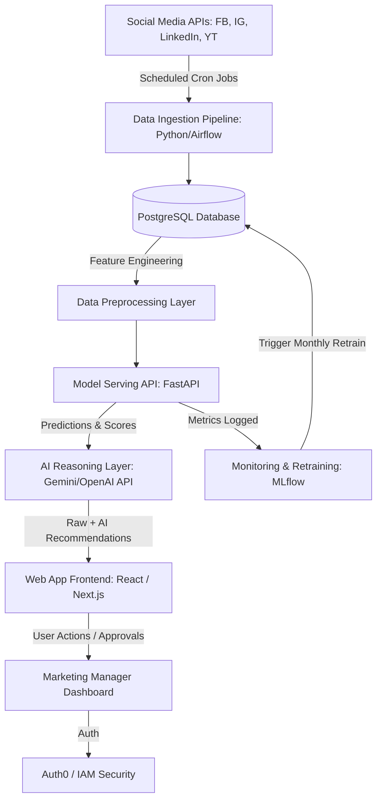

# Part 8: Production Architecture

To scale this from a local notebook to a real tool that Talknlock's 50-100 clients and internal team can use, we need a solid (but simple) production setup. 

Here is the high-level architecture diagram:

---

### Component Breakdown

#### 1. Data Ingestion & Storage
- **Data Collection**: We will run hourly/daily cron jobs using a simple workflow tool (like Apache Airflow or Prefect) to pull data from Facebook Ads API, Instagram Graph API, LinkedIn API, and YouTube Analytics API.
- **Data Storage**: A **PostgreSQL** relational database. It is reliable, handles relational data (Clients, Posts, Metrics), and makes it easy to run SQL queries for analytics.

#### 2. Processing & ML Model serving
- **Preprocessing**: Python script running on a server that maps raw strings (like Platform, Industry) to numeric codes and scales budget figures.
- **ML Model**: The trained Random Forest model will be saved and loaded inside a **FastAPI** microservice. FastAPI is extremely fast and auto-generates API docs (Swagger), making it easy to connect the frontend.
- **AI/LLM Layer**: FastAPI sends the ML prediction + post topic to the LLM (like Gemini Flash or OpenAI API) to get the written content recommendation.

#### 3. Frontend & API/Backend
- **Dashboard**: A clean web app built in **React** or **Next.js** so marketing managers can log in, input post plans, and see predictions.
- **Authentication**: We will use **Auth0** or **Firebase Auth** so users can sign in securely with their company Google accounts. 

#### 4. Monitoring & Model Retraining
- **Monitoring**: We log all user predictions and actual post results (once published and live) to check for "model drift".
- **Retraining**: A monthly automated job runs. It fetches new data from Postgres, retrains the Random Forest model on the last 6 months of data, checks if the accuracy is better than the old model, and updates the active model file (`rf_model.pkl`) automatically.

#### 5. Data Privacy & Security
- **Row-Level Security (RLS)**: Client A's staff must never see Client B's performance data. Postgres RLS ensures users only access data belonging to their assigned clients.
- **API Keys**: All external API keys (Facebook, OpenAI) will be encrypted and stored in a secure key vault (like AWS Secrets Manager or a `.env` file hidden from GitHub).
